# Valheim Vanilla Plus (BepInEx plugin)

Client-side convenience for the unmodded game. No cheats: nothing here changes what your character
can do, what the world gives you or how the game saves. Features are interface helpers (search
boxes, a sign editor, a Clear button) and local visual aids (night vision). Because of that there
is no admin / host requirement.

Some things go beyond what an unmodded player can do:

- Signs may hold 150 characters instead of 50 (the text is still ordinary sign text).
- Night vision lets you see in the dark without a torch (off by default).
- The world seed is shown on servers, where the game itself never displays it.
- The radar shows creatures and players around you through walls and terrain (off by default).
- Waypoint markers are drawn in the world, through walls, not only on the map.
- Craft from chests uses materials from nearby chests without you carrying them (off by default).
- The storage window takes from and stores into nearby chests without you opening them.

## Build & install

```
dotnet build -c Release
```

The build copies `ValheimVanillaPlus.dll` into `Valheim\BepInEx\plugins\ValheimVanillaPlus\`.
If Valheim is installed elsewhere: `dotnet build -c Release -p:ValheimDir="D:\...\Valheim"`.

**Hot reload** (`[General] HotReload`, default on): build while Valheim is running and the new DLL
is loaded in place of the running one within a couple of seconds, no restart. The old code stays
in memory until the game closes; if something looks off after a reload, restart once before
chasing it. See `Core/HotReload.cs`.

**Thunderstore package**: `dotnet build -c Release -t:PackThunderstore` writes
`bin\thunderstore\liekos47-ValheimVanillaPlus-<version>.zip` from the `Thunderstore\` folder
(`manifest.json`, the player README, `CHANGELOG.md`, `icon.png`) plus the DLL. For a release, raise
`Version` in `Core/VanillaPlusPlugin.cs` and `version_number` in the manifest together (the build
refuses if they differ), add a changelog entry, and copy feature changes into `Thunderstore\README.md`.

## Hotkeys (in game)

| Key | Toggle |
|-----|--------|
| Insert | **Options menu**: theme, search and tabs Interface / Crafting / Items / Vision / World / Stats / More (frees the cursor, blocks player input while open) |
| F2 | **Storage window**: all nearby chests as one searchable list with Take / Store |
| Left Alt + click | In the inventory with a chest open: move every stack of the clicked item to the other side |
| Left Alt + Shift + click | In the inventory: drop every stack of the clicked item |
| Home | Night vision (no torch needed at night / in caves) – starts OFF |

Defaults and keys are editable in `BepInEx\config\liekos47.valheimvanillaplus.cfg`, or from the menu's
More tab (Open config file / Reload config file).

**Look** (`[Menu] Theme`, picked at the top of the menu): everything the mod lets you click or
type in (the menu, the storage window, the sign editor panel, the craft search box) is drawn with
one theme. *Valheim* (default) uses the game's own font and the button, text-field and panel
pictures of the game's "Enter text" box; *Dark* and *Light* are flat colors; *Classic* is Unity's
gray. Markers drawn over the world (waypoints, radar, sign search, FPS) keep their own colors.

| Classic | Dark | Light | Valheim |
|---|---|---|---|
| 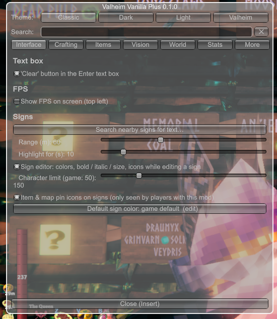 | 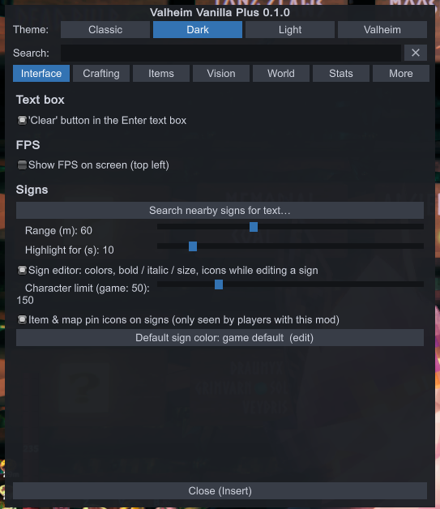 | 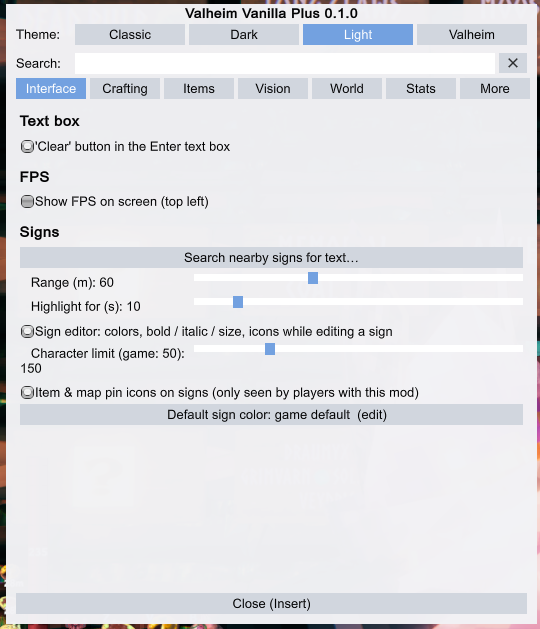 | 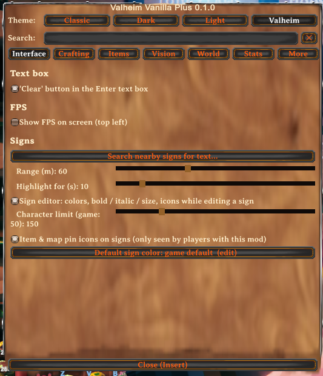 |

## Features

- **Clear button** – a "Clear" button in the game's "Enter text" box (signs, names, portal tags),
  left of Cancel, that empties the field and keeps it focused. `[Interface] ClearButton`, default on.

  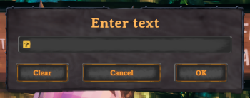

- **FPS counter** – frames per second in the top-left corner, averaged over half a second: green
  from 50, yellow from 25, red below. `[Interface] ShowFps`, default off (menu → Interface).

  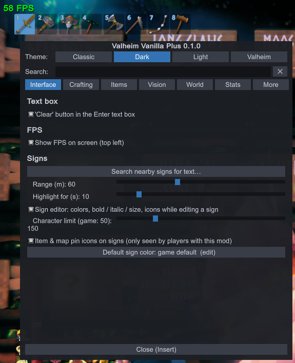

- **World seed** – menu → More shows the name, seed, seed number and generator version of the
  world you are in, with a "Copy seed to clipboard" button. Works on servers too (see How it works).

  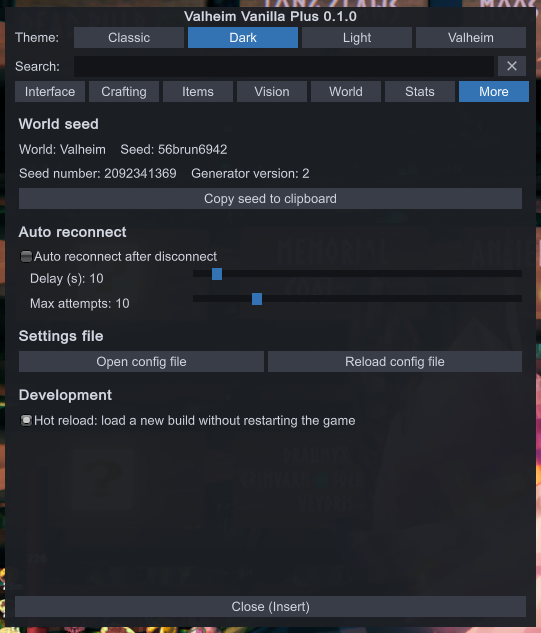

- **Sign editor** – while you edit a sign, a panel next to the text box gives buttons for what
  signs already understand but the game has no UI for: colors (palette, RGB sliders, hex), bold /
  italic / underline / strike / highlight, size, alignment, spacing, fonts, two-tone letters,
  symbols, arrows and icons. The result is ordinary sign text, so other players see it without
  the mod, except the parts marked "only players with this mod" in the panel (item / map pin
  icons, extra fonts, the four added two-tones). `[Signs]` section:
  - `Editor` (on) – the panel itself.
  - `CharacterLimit` (150) – tags use up characters, so the sign limit is raised from the game's 50.
  - `CustomIcons` (on) – item and map pin icons.
  - `DefaultColor` (empty) – color given to a confirmed sign that has none of its own. Set it in
    the menu (Interface → Signs) with the row of ready-made colors, the R / G / B sliders or a
    hex code; "Game default" clears it. The sign editor's "Use current color" sets it too.

  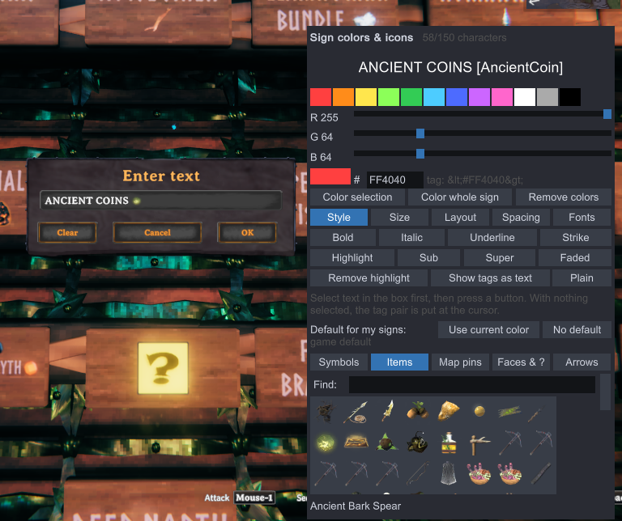

  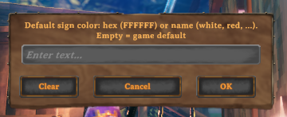

- **Sign search** – menu → Interface → "Search nearby signs for text…": every sign within range
  whose text contains what you typed (any case, tags ignored; commas = any of several words) is
  marked for a few seconds with a rainbow box, a line from the bottom of the screen and its text.
  Visual and local only. `[Signs] SearchRadius` (60 m), `SearchHighlightSeconds` (10),
  `SearchText` (the last search).

  | Search | Result |
  |---|---|
  | 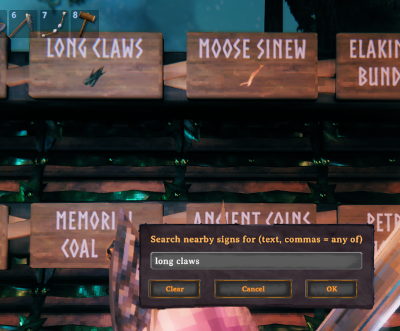 | 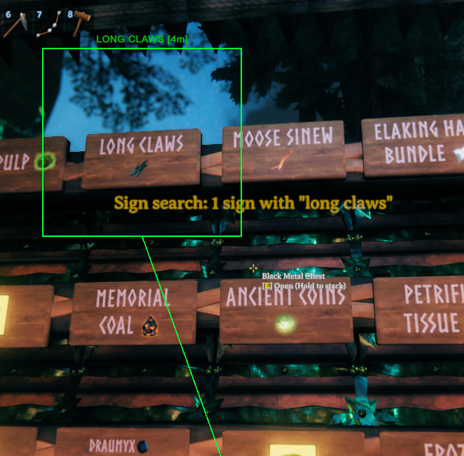 |

- **Craft search** – a search box above the crafting list (inventory, workbench, forge, ...) that
  filters the recipes by the item made or any ingredient, e.g. "bronze" or "copper". Only recipes
  the game already lists are shown; nothing is unlocked. Cleared when the inventory closes.
  `[Crafting] CraftSearch`, default on.
- **Craft from chests** – while crafting or building, materials in nearby player-built chests
  (also carts and ship storage) count as if they were in your inventory; what you lack is taken
  from the closest chests first. The numbers in the crafting panel and the hammer's piece info
  include them, and the recipe list refreshes when chest contents change. Private chests and
  wards are respected, and a chest another player has open is skipped. Menu → Crafting.
  `[Crafting] CraftFromChests` (off), `ChestRange` (30 m). Don't combine with another
  craft-from-containers mod; the menu warns if one is installed.

  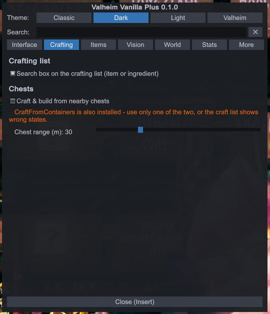

- **Storage window** (F2, or menu → Items) – every item in your nearby player-built chests (also
  carts and ship storage) as one list with icon, total and "in N chests". Search, category filter
  (Materials / Food & meads / Weapons & tools / Armor / Other), sort by name or count, range
  slider, remembered position.
  - *Chests (take)*: Take 1 / Stack / All into your inventory.
  - *My inventory (store)*: Store stack / Store all / Store everything. An item goes only into
    chests that already hold it: a chest holding nothing else first, then mixed ones, closest
    first. When those are full it says "chest full"; when no chest holds the item it says "no
    chest assigned" and stores nothing. Put one in a chest by hand to assign that chest.
  - "Store everything" keeps equipped items, the hotbar row (`KeepHotbar`), the ticked categories
    (`KeepArmor`, `KeepWeapons`, `KeepTools`, `KeepFood`, `KeepAmmo` on by default; `KeepTrophies`
    off) and the never-store list (`NeverStore`, `*` wildcard). "Store stack" and "Store all" on
    a single item ignore the keep rules.
  - Private chests and wards are respected; a chest another player has open is skipped.
  - `[Storage] Enabled` (on), `Range` (30 m), the `Keep…` rules, `NeverStore`, `PositionX` /
    `PositionY`; `[Hotkeys] ToggleStorage` (F2).

  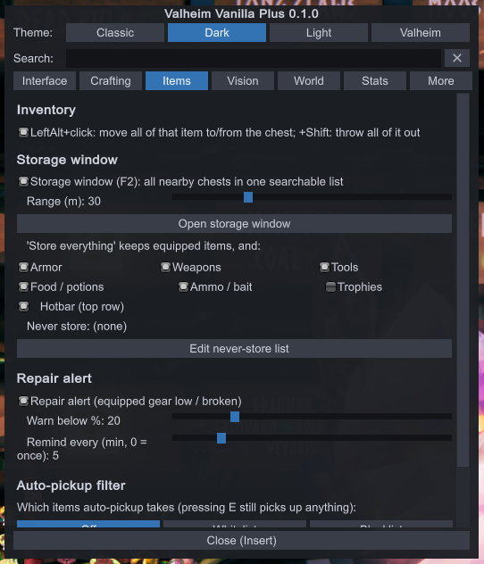

- **Store all button** – a "Store all" button under an open chest that moves everything from
  your inventory into that chest, except equipped items and whatever the storage window's keep
  rules protect (hotbar row, ticked categories, never-store list; one shared set of rules). It
  fills the chest you have open whether or not it already holds the item, and shows "Stored N
  stacks". Menu → Items. `[StoreAll] Enabled` (off).
- **Batch click** – in the inventory screen, Left Alt + click an item with a chest open moves
  every stack of it to the other side; Left Alt + Shift + click drops every stack of it. A
  top-left message says how many stacks moved. Quest items are never touched, and equipped copies
  only if that is the one you clicked. `[Inventory] BatchClick` (on), `BatchMoveKey` (LeftAlt).
- **Auto-pickup filter** – choose what the game's auto-pickup takes (menu → Items): Off,
  Whitelist (only the listed items) or Blacklist (everything except them). Pressing E still picks
  up anything, and the pickup range and speed stay the game's own. List entries are item names,
  prefab (`TrophyDeer`) or as shown in game (`Deer trophy`), any case, with `*` as a wildcard
  (`Trophy*`, `*Ore`, `*mead*`). `[AutoPickup] FilterMode` (Off), `Whitelist`, `Blacklist`; edit
  the lists from the menu or in the config file. "Pick items by icon" in the same section opens
  a grid of every item in the game (read from the running game, so new items appear on their
  own): choose whitelist or blacklist, type in Find to narrow down, click an icon to add it and
  click a framed one (green = whitelist, red = blacklist) to take it out. "Only items in the
  list" shows what a list holds.
- **Range circle** – while you drag a distance slider (storage range, chest range, sign search
  range, radar range, waypoint range), a circle of that radius is drawn on the ground around
  you with the value on it; it fades about 2 s after you stop. `[Menu] RangePreview` (on),
  toggle at the top of the menu.
- **Repair alert** – warns in the middle of the screen when an equipped weapon, tool, shield or
  armor piece drops below a durability line (orange, "… is at 18% - repair soon") and again when
  it breaks (red). Each item warns once per drop; repairing it re-arms the warning. While
  something is still low, a top-left "Needs repair: …" reminder repeats. Menu → Items.
  `[RepairAlert] Enabled` (on), `BelowPercent` (20), `RepeatMinutes` (5, 0 = warn once only).
- **Waypoints** – named spots per world (menu → World → "Add waypoint here"), listed with
  distance and compass direction and Map / Rename / Delete buttons. Shown on screen as a marker
  with name and distance, and as map pins that are not saved to your character. A "Last death"
  waypoint is added where you die. No teleport. Kept only in
  `BepInEx\config\liekos47.valheimvanillaplus.waypoints.txt`. `[Waypoints] Enabled` (on), `OnScreen`
  (on), `OnScreenRange` (0 = any distance), `MapPins` (on), `LastDeath` (on).

  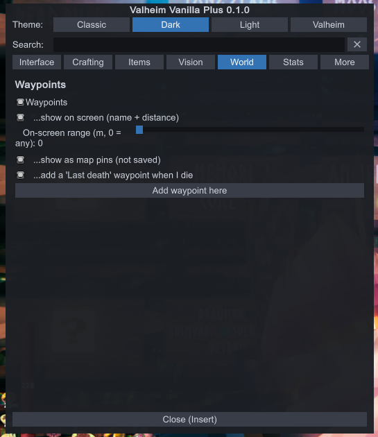

- **Radar** – a round overlay showing creatures and players around you, turning with the camera:
  red = hostile, yellow = passive, green = tamed, purple = boss, blue = players (with names);
  ^ / v marks a dot more than 5 m above / below you. Menu → Vision. `[Radar] Enabled` (off),
  `Range` (60 m), `Size`, `Opacity`, `Corner`, `OffsetX` / `OffsetY`, `Mobs`, `Passive`,
  `Players`, `PlayerNames`.

  | Radar | Settings |
  |---|---|
  | 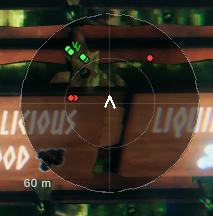 | 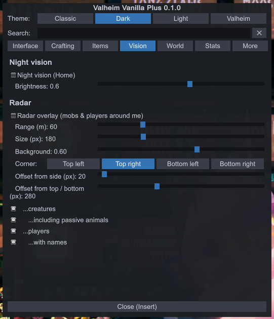 |

- **Player stats** – menu → Stats: a read-only page of your character's numbers, worked out with
  the game's own formulas. Vitals (health, stamina, eitr, armor, movement penalty from gear, carry
  weight), regeneration per second, food eaten with time left, the equipped weapon (damage types,
  damage per hit range from your skill and buffs, stamina per attack, block and parry),
  resistances and weaknesses, active effects with time left, and measured combat from your real
  fighting (swings, hits and damage per second, biggest hit). No settings.

  | Vitals, regeneration, food | Weapon, resistances, effects |
  |---|---|
  | 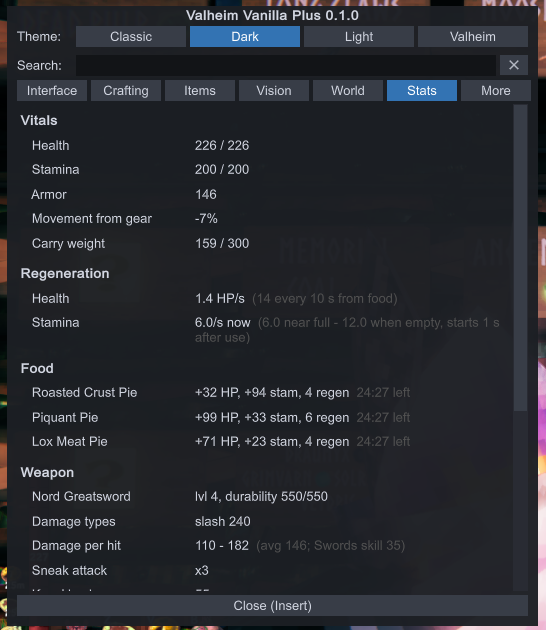 | 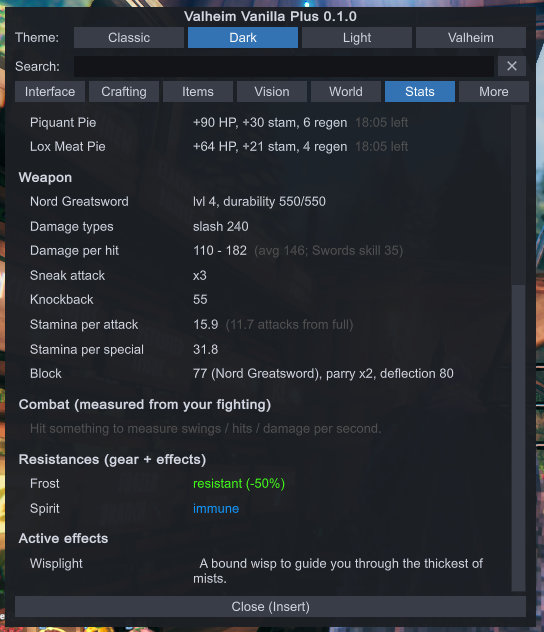 |

- **Auto reconnect** – when a server session ends with "disconnected", the main menu shows a
  countdown box ("Disconnected — reconnecting in 8 s (attempt 1/10)") and joins the same server
  again with the same character. Cancel button or Esc stops it. The server password you typed is
  kept in memory only (never written to disk) and entered for you. Never retries after a kick, a
  ban, a full server, a wrong version or a wrong password. Menu → More. `[AutoReconnect] Enabled`
  (off), `DelaySeconds` (10, min 3), `MaxAttempts` (10).
- **Night vision** – see at night and in caves / crypts without a torch (Home, or menu → Vision).
  Fog is left as the game sets it. Visual and local only. `[NightVision] Enabled` (off),
  `Brightness` (0.6).

  | Off | Brightness 0.5 | Brightness 1.0 |
  |---|---|---|
  | 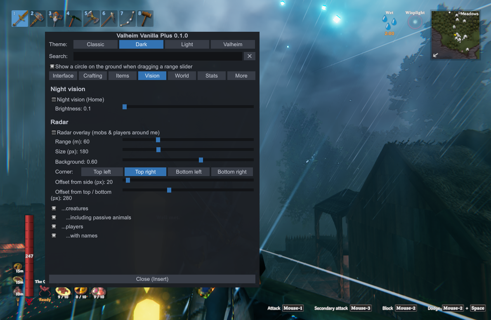 | 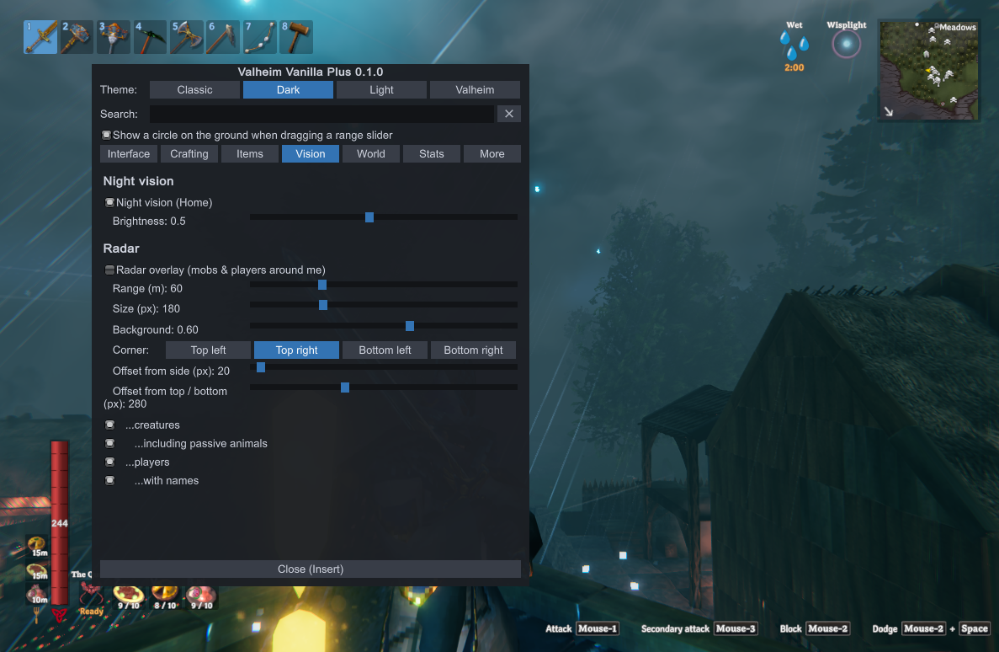 | 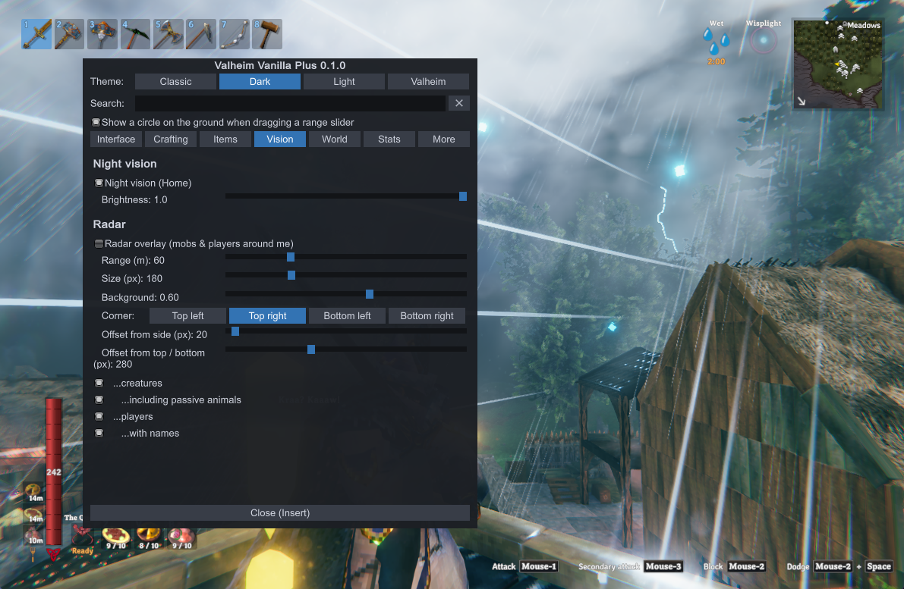 |

## Layout

| Folder | What lives there |
|--------|------------------|
| `Core/` | The plugin (`VanillaPlusPlugin.cs`: config entries, update loop), the options menu (`MenuWindow.cs`, `MenuTheme.cs`) input blocking while typing in a search box (`SearchInputBlock.cs`), hot reload (`HotReload.cs`), and shared helpers: on-screen boxes / lines / labels (`Overlay.cs`), asking for text with the game's box (`TextPrompt.cs`), world key and compass (`WorldInfo.cs`), the range circle (`RangePreview.cs`), the color picker row used in the menu (`ColorPicker.cs`) |
| `Interface/` | Changes to the game's own screens: Clear button (`TextInputClear.cs`), FPS counter (`FpsCounter.cs`) |
| `Crafting/` | Craft search (`CraftSearch.cs`), craft from chests (`CraftFromChests.cs`) |
| `Chests/` | Storage window (`Storage.cs`), Store all button (`StoreAll.cs`), batch click (`BatchTransfer.cs`), the list of loaded chests (`ChestTracker.cs`) |
| `World/` | Waypoints (`Waypoints.cs`) |
| `Stats/` | Player stats tab (`PlayerStats.cs`) |
| `Items/` | Auto-pickup filter (`PickupFilter.cs`), the icon grid for picking items (`ItemPicker.cs`), repair alert (`DurabilityAlert.cs`) |
| `Network/` | Auto reconnect (`AutoReconnect.cs`) |
| `Vision/` | Night vision (`NightVision.cs`), radar (`Radar.cs`) |
| `Signs/` | Sign editor: the panel (`SignEditor.cs`), fonts and two-tones (`SignTags.cs`), item / map pin icons (`SignIcons.cs`); sign search (`SignSearch.cs`) |

Adding a feature: one file in the folder for its area, a `ConfigEntry` bound in
`VanillaPlusPlugin.Awake`, and a `Toggle(...)` line in the matching tab of `MenuWindow.cs`. Then update this README: the
feature list, the hotkey table if it has a key, this table, "How it works" and the update checklist.

## How it works

- **Clear button** – `TextInput.Show` postfix clones the box's Cancel button (same look), sizes it
  like OK, places it one button-step to the left of Cancel, relabels it "Clear" and replaces its
  click with: empty `m_inputField`, re-focus it. Hidden again when the option is turned off. If
  Valheim God Mode is installed too, its own Clear button is used and this one stays hidden.
- **FPS counter** – frames are counted in `Update` and divided by the elapsed unscaled time every
  half second; drawn in `OnGUI` on repaint. Switched off when Valheim God Mode is installed (its
  counter sits in the same corner).
- **World seed** – read from `ZNet.World` (`m_name`, `m_seedName`, `m_seed`, `m_worldGenVersion`).
  A server sends these to every client on join (`ZNet.RPC_PeerInfo`) because the client builds the
  terrain itself, so nothing is requested or guessed. Drawn in `MenuWindow.MoreTab`.
- **Sign editor** – IMGUI panel drawn while `TextInput` is showing for a `Sign`; buttons edit
  `m_inputField.text` (TextMeshPro rich-text tags) at the remembered cursor / selection.
  `TextInput.RequestText` prefix raises the limit for signs; `Sign.SetText` prefix adds the default
  color. Item / map pin icons are extra `TMP_SpriteAsset`s added as fallbacks of the game's default
  set; extra fonts and two-tones are registered with `MaterialReferenceManager`. All of that is
  local to your game. Switched off when Valheim God Mode is installed (it has the same editor).
- **Sign search** – `FindObjectsByType<Sign>` within the radius, `Sign.GetText()` with tags
  stripped, compared case-insensitively; hits are drawn in `OnGUI` with the helpers in
  `Core/Overlay.cs` until the highlight time runs out. Only signs in areas the game has loaded
  are known.
- **Craft search** – IMGUI text field drawn above `InventoryGui.m_crafting`; a change calls
  `InventoryGui.UpdateCraftingPanel` to rebuild the list, and a `Player.GetAvailableRecipes`
  postfix drops the recipes that don't match (prefab or localized name of the item or of any
  ingredient). Switched off when Valheim God Mode is installed (it has the same search).
- **Craft from chests** – a scope counter is raised while the local player's requirements are
  checked, shown or consumed (`Player.HaveRequirementItems`, `HaveRequirements(Piece, mode)`,
  `ConsumeResources`, `InventoryGui.SetupRequirement`). Inside that scope, `Inventory.CountItems`
  / `HaveItem` on your inventory add what the chests hold, and `Inventory.RemoveItem` first takes
  the shortfall from the chests (ownership is claimed so the change is saved, as when you open a
  chest). Chests come from `ChestTracker` (a `Container.Awake` postfix), filtered to player-built
  ones in range that pass `Container.CheckAccess` and `PrivateArea.CheckAccess`. "Only one
  ingredient" recipes stay vanilla. Switched off when Valheim God Mode is installed.
- **Storage window** – IMGUI window over the chests from `ChestTracker` within `Range` that pass
  the same access checks as craft from chests. Rows group items by name + quality + variant.
  Take / Store claim the chest's `ZNetView` (only the owner's changes are saved) and move with
  `Inventory.MoveItemToThis`, topping up existing stacks before using empty slots. While it is
  open the cursor is free and player input is blocked, like the menu. God mode's shopping-list
  section, "Craft & upgrade" tab and range circle were left out. Switched off
  when Valheim God Mode is installed.
- **Store all button** – IMGUI button placed under `InventoryGui.m_container` while a chest is
  open; each inventory item not kept (`Storage.Kept`, equipped, hotbar row) goes through
  `Inventory.MoveItemToThis` into `m_currentContainer`. Switched off when Valheim God Mode is
  installed.
- **Batch click** – `InventoryGui.OnSelectedItem` prefix: with the move key held, every stack with
  the clicked item's name goes through `Inventory.MoveItemToThis` (move) or `Player.DropItem`
  (drop), the same calls the game uses for a single stack. Switched off when Valheim God Mode is
  installed.
- **Auto-pickup filter** – `Player.AutoPickup` prefix clears `m_autoPickup` on the filtered
  `ItemDrop`s within pickup range (+2 m) and a finalizer sets it back, so the game's own pass
  skips them for that call only. Each list entry becomes a case-insensitive pattern (`*` = any
  characters) matched against the prefab name and the localized name. Switched off when Valheim
  God Mode is installed (it has its own filter, without wildcards). The icon picker lists
  `ObjectDB.instance.m_items` entries that have an icon, sorted by localized name; a click adds
  the prefab name to the list setting or removes the entry with that prefab / shown name. An
  item covered only by a `*` entry is framed but can't be clicked out; edit the text for that.
- **Range circle** – `MenuWindow.Slider` calls `RangePreview.Show` for sliders labelled in meters
  ("(m)"), as does the storage window's range slider. The ring is 72 points around the player at
  ground height (`ZoneSystem.GetGroundHeight`, or the water level where higher), projected with
  `Camera.WorldToScreenPoint` and drawn as lines in `OnGUI`.
- **Repair alert** – once a second, `Inventory.GetEquippedItems()` is checked: `m_durability /
  GetMaxDurability()` for items that use durability. Warnings go through `Player.Message` and the
  log; nothing on the item is changed. Switched off when Valheim God Mode is installed (it has
  the same alert).
- **Waypoints** – a tab-separated text file, one line per waypoint (world key, name, x, y, z);
  the world key is server address + world name + world id. Map pins use `Minimap.AddPin` with
  save = false and are removed again when the option is off or on hot reload. Markers are drawn
  in `OnGUI` from `Camera.WorldToScreenPoint`. A `Player.OnDeath` prefix sets "Last death". God
  mode's Teleport button was left out (it does what the `goto` dev command does). Switched off
  when Valheim God Mode is installed; the two mods keep separate waypoint files.
- **Radar** – `Character.GetAllCharacters()` within `Range` (flat distance), placed by the
  camera's heading; hostile = `BaseAI.IsEnemy`, plus `IsTamed` / `IsBoss` / `IsPlayer`. Fixed dot
  colors (god mode takes them from its ESP settings). Waypoint markers and the radar are hidden
  while the inventory, a trader or the map is open. Switched off when Valheim God Mode is installed.
- **Player stats** – values are read from `Player` (`GetMaxHealth`, `GetBodyArmor`, `GetFoods`,
  `GetDamageModifiers`, ...), its `SEMan` (regen and attack modifiers, status effects) and the
  equipped item (`GetDamage`, `GetBlockPower`); stamina cost follows `Attack.GetAttackStamina`.
  Measured combat comes from two patches that only count: `Humanoid.StartAttack` postfix (your
  swings) and `Character.Damage` prefix (hits you deal). God mode's Performance section was left
  out. Runs alongside Valheim God Mode's own Stats tab.
- **Auto reconnect** – `FejdStartup.JoinServer` prefix remembers the server (`m_joinServer`),
  `ZNet.OnPasswordEntered` prefix the password, `FejdStartup.ShowConnectError` postfix starts the
  countdown for `ErrorDisconnected` (and `ErrorConnectFailed` once retrying, for a server still
  restarting). When it runs out: `SetServerToJoin` + `JoinServer`, the menu's own join path. God
  mode's "also after being kicked" was left out. The remembered server and password live in
  memory, so a hot reload forgets them until you next join. Switched off when Valheim God Mode is
  installed (it has the same feature).
- **Night vision** – `EnvMan.SetEnv` postfix raises `RenderSettings.ambientLight` to at least
  `Brightness` per channel; fog is not touched (god mode's "clear dark fog" was left out).
  Daylight is already brighter than the minimum, so daytime barely changes. Switched off when
  Valheim God Mode is installed (it has the same feature on the same key).
- **Theme** – `MenuTheme` builds a `GUISkin` from a copy of Unity's default one. For the Valheim
  theme it reads the "Enter text" box (`TextInput.instance.m_panel`): the first button's `Image`
  sprite with its hover / pressed tints, the input field's sprite and text color, and the panel
  background. The game keeps these on a shared sheet that can't be read directly, so the sheet is
  drawn into a temporary texture (`Graphics.Blit` + `ReadPixels`) and each picture cut out, with
  its 9-slice border carried over. The font is the game's `AveriaSerifLibre-Bold` as a plain
  Unity font. The box only exists in a world, so at the main menu, and if anything can't be read,
  the theme uses plain wood-brown colors; what was found is written to the log ("Valheim theme:
  ..."). `OnGUI` draws the world markers with Unity's skin first, then switches to the theme.
- **Menu** – IMGUI window drawn from `OnGUI`. While open, `GameCamera.UpdateMouseCapture` is
  skipped (cursor free) and `Player.TakeInput` / `PlayerController.TakeInput` return false. While
  the search box has focus, `ZInput` key / button reads return false so typing doesn't trigger
  game keys.

## After a Valheim update

1. Rebuild against the new game DLLs (`dotnet build -c Release`) and fix any compile errors.
2. Open a sign's text box and check the Clear button is there, in line with Cancel / OK.
3. Check the sign editor panel appears beside it, and that a colored sign with an item icon still draws.
4. Run a sign search and check the matching signs get their box, line and text.
5. Open the crafting list, type in its search box and check the list narrows and comes back when cleared.
6. Toggle night vision (Home) at night or in a crypt and check it brightens and switches off cleanly.
7. Set the pickup filter to Blacklist with `Stone`, walk over stone and wood: wood is picked up, stone stays until you press E.
8. Turn on the FPS counter and check it shows top left; open menu → More and check the world name and seed are filled in and the copy button works.
9. Raise the repair alert's "Warn below %" above a worn equipped item's durability and check the orange warning appears.
10. With auto reconnect on, join a server and have it restart (or pull the network briefly): the countdown box appears at the main menu and the rejoin goes through, password included.
11. With craft from chests on, stand at a workbench with the materials only in a nearby chest: the recipe shows as craftable, crafting takes them from the chest, and the same for a hammer piece.
12. Open a chest, Alt + click an item you hold several stacks of: all stacks move. Alt + Shift + click: all drop.
13. Add a waypoint: its marker shows in the world and its pin on the map; die once and check "Last death" appears.
14. Turn on the radar near some animals and check the dots turn with the camera.
15. Open menu → Stats with food eaten and a weapon equipped: every section fills in; hit something and check the combat numbers move.
16. Press F2 near some chests: the list fills; Take 1 / Stack / All work; Store all sends an item to the chest already holding it, says "chest full" when that chest is full and "no chest assigned" for an item no chest holds.
17. With the Valheim theme, open the menu in a world: buttons, text fields and the window should look like the game's "Enter text" box. If they are plain brown, check the log line starting "Valheim theme:".
18. Drag a range slider: the circle shows on the ground. Open "Pick items by icon": the grid fills, includes any items the update added, and clicking adds / removes list entries.
19. With the Store all button on, open a chest: the button sits under the chest panel and moves everything except equipped items and the kept categories.
20. Build once more with the game running and check the log says "Hot reload: switching to the build from ...".
